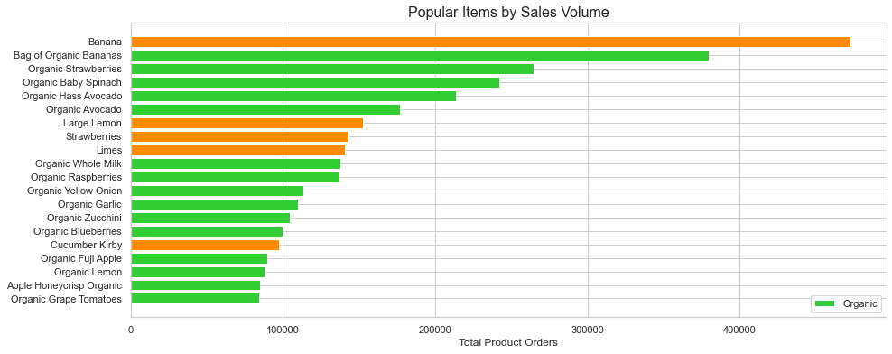
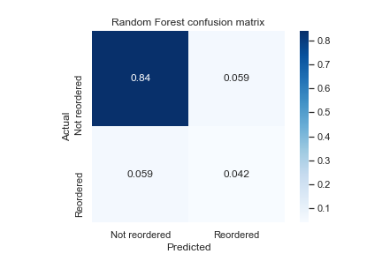

## Instacart Market Basket Analysis [Final Report]

### Abstract

Instacart is an online grocery delivery service and app. The company wants to enhance the shopping experience by developing tools to recommend items to users based on their purchase history. 

The goal of this project is to predict which products will be in a user's next order. We will develop a classification model to predict whether a user will reorder products from their purchase history or not.

### Data

The [dataset](https://www.instacart.com/datasets/grocery-shopping-2017) is anonymized and contains a sample of over 3 million grocery orders from more than 200,000 Instacart users. The data dictionary available [here](https://gist.github.com/jeremystan/c3b39d947d9b88b3ccff3147dbcf6c6b).

### Algorithms

*Feature Engineering*: Creating user-product level features required merging datasets and groupby aggregations.

*Optimization Metrics*: In the business context, precision indicates the extent to which our model is incorrectly predicting that a user will be interested in re-ordering certain items. A low precision score means users see suggested products they are not actually interested in purchasing. On the other hand, recall indicates the proportion of actually reordered products that we correclty predicted would be reordered. Low recall means our model is missing out on showing products that our user is interested in. To keep suggestions relevant (maximize precision) and promote purchases (maximize recall), we chose to optimize for the F1 metric. We believe this will lead to the best shopping experience. 

*Models*: Logistic regression was used to build a baseline model with six features and balanced class weights; this model achieved an F1 score of 0.38. A random forest model with balanced class weights achieved our best F1 score of 0.42. This model will be the basis of future work.

### Tools

* Numpy & Pandas for data processing 
* Seaborn for visualization
* Scikit-learn for machine learning

### Communication 

These slides and visuals will be shared at Instacart's next Engineering Team meeting.

The top Produce item is Bananas by far, and organic produce is very popular, with 15 of the top 20 products being organic.

Our random forest model was able to achieve recall and precision scores of 42% and an F1 score of 0.42. This model can serve as the basis for a recomendation system.

