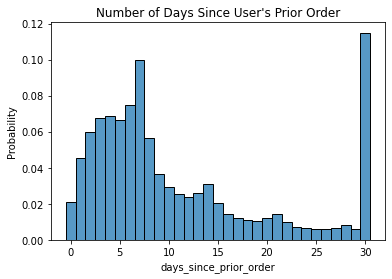
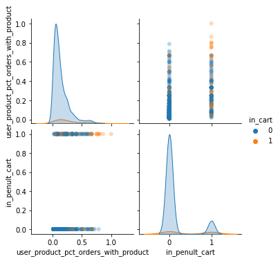

## Instacart Market Basket Analysis [MVP]

Instacart makes it easy for users to shop for groceries from the comfort of their home with an easy-to-use app interface. The data science team wants enhance the shopping experience by developing tools to recommend items to users based on their purchase history. 

I am looking at Instacart's public anonymized dataset, [“The Instacart Online Grocery Shopping Dataset 2017”](https://www.instacart.com/datasets/grocery-shopping-2017) which contains a sample of over 3 million grocery orders from more than 200,000 Instacart users. The data dictionary can be accessed [here](https://gist.github.com/jeremystan/c3b39d947d9b88b3ccff3147dbcf6c6b).

Some interesting points were drawn from initial data exploration: 

Users tend to make purchases on a weekly basis, and often even more frequently.

The top Produce item is Bananas by far, and organic produce is very popular, with 15 of the top 20 products being organic.

Using feature engineering, we constructed two features to predict whether a certain item from a user's purchase history would appear in their next basket: 

1. The proportion of prior orders that contained that product.
2. Whether or not the product was in the user's last cart (the penultimate if you include the cart being predicted). 

With a logistic regression classifier, we achieved an F1 score of 0.24 using these two features only. We want to construct more and better features and use more sophisticated modeling to improve our classifier.
